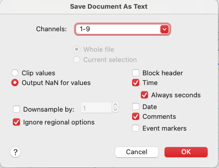
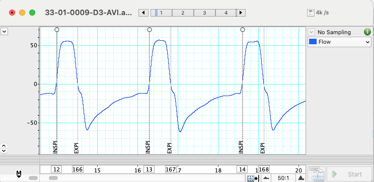

# resp_metrics

Cycle-by-cycle ventilatory metrics (BF, VT, VE, Ti, Te, Ttot, I:E, ...) computed from respiratory signals exported from ADInstruments LabChart.

## Features

- Parse LabChart `.txt` exports using [labchart_parser](https://github.com/Neures-1158/labchart_txt_parser).  Export from labchart as follows:
  

    - Before exporting in LabChart, make sure time is displayed as "Start from Block"

- Extract respiratory cycles from INSPI/EXPI comments obtained using a macro in labchart. Absence of automatic detection is deliberate as it forces thorough inspection of signals.

  

- Compute ventilatory variables for:
  - **Spontaneous breathing** (Flow inspiration negative).
  - **Mechanical ventilation** (Flow inspiration positive).
- Outputs per-cycle DataFrames with standard metrics (BF, VT, VE, Ti, Te, I:E, PIF, PEF, PTP, WOB).
- For mechanical ventilation, also returns PEEP, Ppeak, ΔP, MAP, etc. (Pplat, Cstat, R left NaN for now in absence of inspiratory hold AND detection). 

## Installation

You can install in two ways:

### Option 1 – Direct install from GitHub
Install directly into your environment with pip:

```bash
pip install git+https://github.com/Neures-1158/resp_metrics.git
```

### Option 2 – Development mode (editable install)
Clone the repository locally and install in editable mode:

```bash
git clone https://github.com/Neures-1158/resp_metrics.git
cd resp_metrics
pip install -e .
```

## Usage

See [`examples/example_usage.py`](examples/example_usage.py) for full code.

## License

[MIT License](LICENSE)

## Contributors & Maintainers

This project is maintained under the [NEURES Lab GitHub organization](https://github.com/Neures-1158).  
Main maintainer: **Damien Bachasson** (author and lead developer).

Contributions from lab members, collaborators, and the wider community are very welcome. Please feel free to contribute by submitting issues or pull requests on GitHub.
