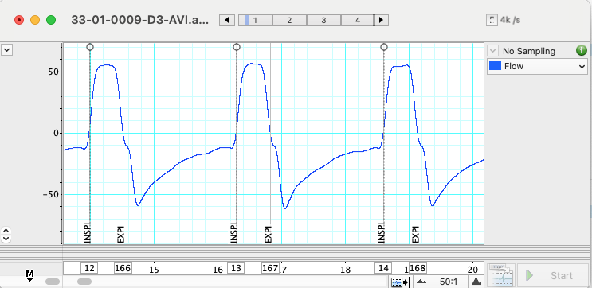

# Resp Metrics

[](https://github.com/Neures-1158/resp_metrics/actions/workflows/ci.yml)
[](https://opensource.org/licenses/MIT)
[](https://www.python.org/downloads/)

Cycle-by-cycle respiratory metrics from ADInstruments LabChart text exports.
`resp_metrics` builds on
[labchart_parser](https://github.com/Neures-1158/labchart_txt_parser).

## Export from LabChart


Set time display to **"Start from Block"** before exporting, and make sure **"Block header"** is ticked.

Respiratory cycles are read from user-placed `INSPI` and `EXPI` comments. No
automatic breath detection is performed; this is deliberate so signals are
visually inspected before analysis.



## Install

```bash
pip install git+https://github.com/Neures-1158/resp_metrics.git
```

For development: `pip install -e ".[dev]"` (adds pytest, ruff, black, isort,
build, and twine).

## Quick start

```python
from resp_metrics import compute_from_labchart

result = compute_from_labchart(
    "examples/data/labchart_file_vs.example.txt",
    block=1,
    flow_col="Flow",
    flow_unit="L/s",
    volume_col=None,
    pressure_col="Pressure",
    mechanically_ventilated=False,
)

result["cycles"].head()
result["ventilatory"].head()
```

Lower-level functions are available for custom pipelines:

```python
from labchart_parser import LabChartFile
from resp_metrics import cycles_from_comments, ventilatory_from_cycles

lc = LabChartFile.from_file("data/recording.txt")
cycles = cycles_from_comments(lc.comments, block=1)
metrics = ventilatory_from_cycles(
    lc.get_block_df(1),
    cycles,
    flow_col="Flow",
    flow_unit="L/s",
)
```

See [examples/example_usage.py](examples/example_usage.py) and
[examples/example_notebook.ipynb](examples/example_notebook.ipynb).

## Metrics

- Spontaneous breathing: inspiration is negative flow.
- Mechanical ventilation: inspiration is positive flow.
- Standard outputs: `BF`, `VT`, `VE`, `Ti`, `Te`, `Ttot`, `IE`, `PIF`, `PEF`,
  `PTP`, and `WOB`.
- Mechanical ventilation also returns `PEEP`, `Ppeak`, `Pplat`, `dP`, `Cstat`,
  `R`, and `MAP` when signals support them.

## Limitations

- `Pplat`, `Cstat`, and `R` require a low-flow inspiratory plateau.
- If `Pplat` is unavailable, `dP = Ppeak - PEEP` is a fallback and
  overestimates true driving pressure.
- True `WOB` requires esophageal pressure (`Pes`); airway pressure is not
  substituted.
- The final cycle in each block is excluded because the next inspiration onset
  is unknown.

## Tests

```bash
pytest
```

## Maintainer

Maintained under [NEURES](https://github.com/Neures-1158). Lead: Damien
Bachasson, PhD ([GitHub](https://github.com/dambach) |
[ORCID](https://orcid.org/0000-0001-6335-9916) |
[Lab](https://sante.sorbonne-universite.fr/structures-de-recherche/neurophysiologie-respiratoire-experimentale-et-clinique)).
Issues and PRs welcome.

MIT licensed. See [LICENSE](LICENSE).
