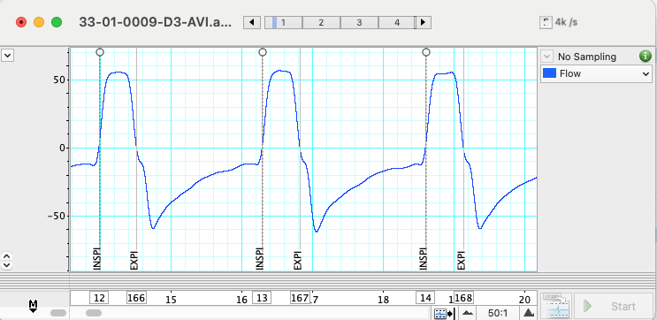

# Resp Metrics

[](https://github.com/Neures-1158/resp_metrics/actions/workflows/ci.yml)
[](https://opensource.org/licenses/MIT)
[](https://www.python.org/downloads/)

Cycle-by-cycle respiratory metrics from ADInstruments LabChart text exports.
`resp_metrics` builds on
[labchart_parser](https://github.com/Neures-1158/labchart_txt_parser).

## Export from LabChart


Set time display to **"Start from Block"** before exporting, and make sure **"Block header"** is ticked.

Respiratory cycles are read from user-placed `INSPI` and `EXPI` comments. No
automatic breath detection is performed; this is deliberate so signals are
visually inspected before analysis.



## Install

```bash
pip install git+https://github.com/Neures-1158/resp_metrics.git
```

For development: `pip install -e ".[dev]"` (adds pytest, ruff, build, and twine).

## Quick start

```python
from resp_metrics import compute_from_labchart

result = compute_from_labchart(
    "examples/data/labchart_file_vs.example.txt",
    block=1,
    flow_col="Flow",
    flow_unit="L/s",
    volume_col=None,
    pressure_col="Pressure",
    mechanically_ventilated=False,
)

result["cycles"].head()
result["ventilatory"].head()
```

Lower-level functions are available for custom pipelines:

```python
from labchart_parser import LabChartFile
from resp_metrics import cycles_from_comments, ventilatory_from_cycles

lc = LabChartFile.from_file("data/recording.txt")
cycles = cycles_from_comments(lc.comments, block=1)
metrics = ventilatory_from_cycles(
    lc.get_block_df(1),
    cycles,
    flow_col="Flow",
    flow_unit="L/s",
)
```

See [examples/example_notebook.ipynb](examples/example_notebook.ipynb).

## Metrics

- Spontaneous breathing: inspiration is negative flow.
- Mechanical ventilation: inspiration is positive flow.
- Standard outputs: `BF`, `VT`, `VT_Ti`, `VE`, `Ti`, `Te`, `Ttot`, `Ti_Ttot`,
  `IE`, `PIF`, `PEF`, `PTP`, `dPmo` and `Pmo_mean`.
- Mechanical ventilation also returns `PEEP`, `Ppeak`, `Pplat`, `dP`, `Cstat`,
  `R`, and `MAP` when signals support them.

### Respiratory effort (Pes / Pga / Pdi)

Pass `pes_col` (and optionally `pga_col`, `pdi_col`, `pdi_max`, `pga_max`) to
add per-cycle indices of inspiratory and expiratory effort. They are merged
into the `ventilatory` table and also returned as a standalone `effort` table.

| Metric | Definition | Unit |
| --- | --- | --- |
| `Pes_ee` | end-expiratory Pes, absolute (indirect marker of operating lung volume) | cmH2O |
| `dPes` | `Pes_baseline − min(Pes)` | cmH2O |
| `dPga` | `max(Pga) − Pga_baseline` | cmH2O |
| `dPga_corr` | `max(Pga) − Pga[nadir]`, from the nadir to `t_expi` | cmH2O |
| `dPdi` | `max(Pdi) − Pdi_baseline` | cmH2O |
| `WOB` | `∫ (Pes_baseline − Pes) × (−Flow) dt`, work of breathing | J |
| `PTPes` | `∫ (Pes_baseline − Pes) dt` | cmH2O·s·breath⁻¹ |
| `PTPga` | `∫ (Pga − Pga_baseline) dt` | cmH2O·s·breath⁻¹ |
| `PTPga_corr` | `∫ (Pga − Pga[nadir]) dt`, from the nadir to `t_expi` | cmH2O·s·breath⁻¹ |
| `PTPdi` | `∫ (Pdi − Pdi_baseline) dt` | cmH2O·s·breath⁻¹ |
| `PTPdi_PTPes` | `PTPdi / PTPes`, diaphragmatic share of the effort | — |
| `TTIdi` | `(mean inspiratory Pdi / Pdi_max) × (Ti / Ttot)` | — |
| `dPga_exp` | `max(Pga) − Pga[nadir]`, from the nadir to `t_next_inspi` | cmH2O |
| `PTPga_exp` | `∫ (Pga − Pga[nadir]) dt`, from the nadir to `t_next_inspi` | cmH2O·s·breath⁻¹ |
| `TTIabd` | `(mean expiratory Pga / Pga_max) × (Te / Ttot)` | — |

Two reference conventions coexist, and the split is not inspiratory versus
expiratory:

- **Baseline-referenced** — `dPes`, `dPga`, `dPdi`, `WOB`, `PTPes`, `PTPga`,
  `PTPdi`. Computed over `[t_inspi, t_expi]` and referenced to the median of
  the `baseline_window` preceding inspiration onset (0.2 s by default), i.e.
  the resting end-expiratory level. `Pes_ee` is that baseline itself.
- **Nadir-referenced** — `dPga_corr`, `PTPga_corr`, `dPga_exp`, `PTPga_exp`.
  Computed *from the Pga nadir* to the end of the phase, and referenced to
  Pga at that instant. The nadir is searched over the first `pga_nadir_frac`
  of the phase: `[t_inspi, t_expi]` for the inspiratory pair,
  `[t_expi, t_next_inspi]` for the expiratory pair.

`TTIdi` and `TTIabd` additionally divide by `Ttot`, so they span the whole
cycle. `Pdi` is read from `pdi_col` when given, otherwise derived as
`Pga − Pes`. Definitions follow the
[ATS/ERS Statement on Respiratory Muscle Testing](https://www.atsjournals.org/doi/10.1164/rccm.166.4.518)
(*Am J Respir Crit Care Med* 2002;166:518-624) and the
[ERS statement on respiratory muscle testing at rest and during exercise](https://publications.ersnet.org/content/erj/53/6/1801214)
(Laveneziana et al., *Eur Respir J* 2019;53:1801214).

```python
from resp_metrics import compute_from_labchart

res = compute_from_labchart(
    "examples/data/labchart_file_pressures.example.txt",
    block=1,
    flow_col="flow",
    flow_unit="L/s",
    volume_col=None,
    pressure_col="Pmo",
    pes_col="Pes",
    pga_col="Pga",
    pdi_col="Pdi",
    pdi_max=97.0,  # cmH2O, measured during a maximal inspiratory manoeuvre
    pga_max=110.0,  # cmH2O, measured during a maximal expiratory manoeuvre illustrative value only — see Limitations
)
res["effort"].head()
```

## Limitations

- `Pplat`, `Cstat`, and `R` require a low-flow inspiratory plateau.
- If `Pplat` is unavailable, `dP = Ppeak - PEEP` is a fallback and
  overestimates true driving pressure.
- `dPmo` (swing) and `Pmo_mean` (mean) come from `pressure_col`. Under
  inspiratory threshold loading that channel carries the applied load, which is
  why they sit with the ventilatory pattern rather than the effort indices.
  `dPmo` is referenced to the pre-inspiratory baseline and is immune to a DC
  offset; `Pmo_mean` is absolute, matching the average inspiratory mouth
  pressure (`PM`) reported by Bird et al., so comparing it with `PTP`/`Ti`
  reveals an offset on the channel.
- `WOB` requires esophageal pressure (`pes_col`) and flow; airway pressure is
  not substituted, as it would not represent patient effort.
- `PTPes` is not corrected for chest wall elastic recoil, which would require
  chest wall elastance. It is a practical within-subject index of global
  inspiratory effort, not an absolute measure.
- Gastric metrics are reported twice. When expiratory abdominal muscles are
  recruited, Pga is still elevated at the INSPI marker and falls as they relax
  at the start of inspiration, so the end-expiratory baseline sits above the
  relaxed level and `dPga` / `PTPga` are underestimated — an artifact ATS/ERS
  2002 explicitly flags. `dPga_corr` and `PTPga_corr` reference the Pga nadir
  instead (search window `pga_nadir_frac`, default the first third of the
  phase) and match the uncorrected values when no such recruitment is
  present. `Pes` and `Pdi` are left uncorrected: their swings are an order of
  magnitude larger so the same offset is negligible, and `Pdi` is derived from
  `Pga` and `Pes` and cannot take an independent reference.
- `Pes_ee` is reported as an absolute value, so unlike every other effort
  column it carries any DC offset of the channel. ERS 2019 uses end-expiratory
  Poes to reveal intrinsic PEEP when hyperinflation is suspected, but it is a
  surrogate only — the reference method for end-expiratory lung volume is the
  inspiratory capacity manoeuvre. Read changes across conditions rather than a
  single absolute level.
- `TTIdi` needs `Pdi_max` from a maximal manoeuvre; it cannot be derived from
  tidal breathing and stays `NaN` when not supplied. The diaphragm fatigue
  threshold is a `TTIdi` of 0.15–0.18 (ATS/ERS).
- The expiratory columns (`_exp`) are gastric: ERS 2019 designates Pga as the
  signal of the main expiratory muscles, the abdominals. They reference Pga to
  the nadir over the first `pga_nadir_frac` of expiration — the relaxed
  abdominal level — and integrate from that instant, not from `t_expi`. Unlike `dPga`, they have no uncorrected counterpart because
  neither boundary of the expiratory window is a resting instant: at `t_expi`
  the inspiratory effort is still ending (Pes is far below its resting level),
  and end-expiration is the peak of abdominal contraction, which drives the
  pressure-time products negative on most cycles. ATS/ERS 2002 sanctions the
  measurement ("PTP of the expiratory muscles can also be measured") and points
  at this signal ("Examination of the Pga signal during expiration […] allows
  detection of phasic expiratory muscle activity").
- `TTIabd` needs `Pga_max` from a maximal expiratory manoeuvre and stays `NaN`
  otherwise, exactly like `TTIdi` with `Pdi_max`. The value used in the example
  above is illustrative, not measured.
- The final cycle in each block is excluded because the next inspiration onset
  is unknown.

## Tests

```bash
pytest
```

## Maintainer

Maintained under [NEURES](https://github.com/Neures-1158). Lead: Damien
Bachasson, PhD, HDR ([GitHub](https://github.com/dambach) |
[ORCID](https://orcid.org/0000-0001-6335-9916) |
[Lab](https://sante.sorbonne-universite.fr/structures-de-recherche/neurophysiologie-respiratoire-experimentale-et-clinique)).
Issues and PRs welcome.

MIT licensed. See [LICENSE](LICENSE).
